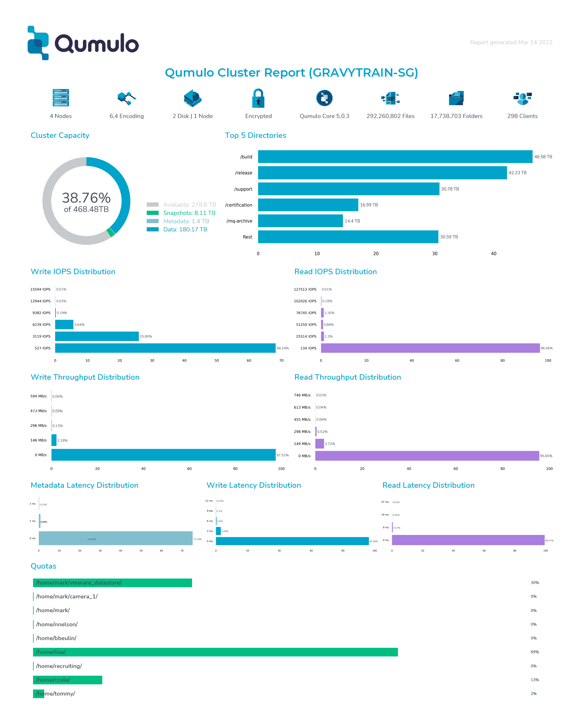

# StorageReport

## Table of Contents

   * [Introduction](#introduction)
   * [Getting Started](#getting-started)
   * [Configuration](#configuration)
   * [Configuring Docker Execution](#configuring-docker-execution)
   * [Why Docker?](#why-docker)
   * [Additional Documentation](#additional-documentation)
   * [Help](#help)
   * [Copyright](#copyright)
   * [License](#license)
   * [Trademarks](#trademarks)
   * [Contributors](#contributors)

## Introduction

This docker application generates a report in either PDF or HTML format on the status of
a Qumulo cluster.

With this report, a consumer can view all of the major data analysis elements that are available on
the Qumulo UI; albeit in a graphical report.

Here is a sample of the report




## Getting Started

Before you can configure and get this report to work on your system, you will need to clone this repository on your
machine. For that, you will need to have `git` installed on your machine.

Once git is operational, then find or create a directory where you wish to store the contents of the `StorageReport` repository and
clone it to your machine with the command `git clone https://github.com/Qumulo/StorageReport.git`

You will notice that the `git clone` command will create a new directory in your current location call `StorageReport`.

The contents of that directory should look like:

```
-rw-r--r--  1 someone  somegroup     1063 Mar 17 08:24 LICENSE
-rw-r--r--  1 someone  somegroup    12530 Mar 30 09:23 README.md
drwxr-xr-x  4 someone  somegroup      128 Mar 30 09:17 config
-rw-r--r--  1 someone  somegroup      378 Apr  4 12:15 docker-compose-windows.yml
-rw-r--r--  1 someone  somegroup      425 Mar 31 12:26 docker-compose.yml
drwxr-xr-x  4 someone  somegroup      128 Mar 17 08:24 docs
drwxr-xr-x  3 someone  somegroup       96 Mar 29 18:35 reports
-rw-r--r--  1 someone  somegroup      922 Apr  4 12:15 start-docker-storagereport.ps1
-rw-r--r--  1 someone  somegroup      456 Mar 31 12:56 start-docker-storagereport.sh
-rw-r--r--  1 someone  somegroup      557 Apr  4 12:15 stop-docker-storagereport.ps1
-rw-r--r--  1 someone  somegroup      288 Mar 31 12:56 stop-docker-storagereport.sh
-rw-r--r--  1 someone  somegroup  7226342 Mar 22 08:33 test_email.windows-latest.exe
-rw-r--r--  1 someone  somegroup  6145736 Mar 22 08:33 test_email.ubuntu-latest
-rw-r--r--  1 someone  somegroup  5394624 Mar 22 08:33 test_email.macos-latest

```

Of course, the owner will not be `someone` and the group will not be `somegroup`, but will show you as the owner and the group as whatever group you currently belong to. If in doubt, simply type `id -gn` to see your current group and `id -un` to see your current login id.

You will need to modify the configuration file and one shell script to get this report to run in your environment. Let us
start with the configuration file.

## Configuration

In the directory `config`, there is a file called `config.json` that must be modified
in order to run the report.

This application depends upon the file name `config.json` in the subdirectory `config`. Due to that restriction,
this file and the diretory it is contained in should not be moved or renamed.

Here is the empty file and, in the following paragraphs, we will describe each field
and their proper values.

```
{
    "cluster_name": "",
    "cluster_port": 8000,
    "cluster_username": "",
    "cluster_password": "",
    "report_type": "pdf",
    "report_directory": "./reports",
    "frequency":
    {
	"when": "daily",
	"hour": "23:00"
    },
    "email":
    {
	"from": "",
	"to": "",
	"login": "",
	"password": "",
	"server": "smtp.gmail.com",
	"port": 465,
	"use": "ssl"
    }
}
```

There are three main sections in the configuration file `config.json`. They are defined as 
`cluster information and report type`, `frequency`, and `email`.

1. Cluster Information
  
   - `cluster_name` - FQDN or IP address of the cluster to monitor.
   - `cluster_port` - The TCP port on which to access the cluster. The default is 8000.
   - `cluster_username` - Username needed to login to the cluster.
   - `cluster_password` - Password need to login to the cluster for the above username.
   - `report_type` - What type of report to generate. The only values are `pdf` or `html`.
   - `report_directory` - Directory location to store the completed reports.

You will notice that there is an entry for `report_directory`. If you do not modify this field, then
the reports will be deposited in the subdirectory called `reports` in the `StorageReport` directory. If you
wish to change the location, simply type in either a relative or absolute path to a location to store
the reports. This directory must exist, so don't forget to create the directory before you start
the application.

2. Frequency

   - `when` - How often should the report be run. The allowed values are `once`, `daily`, and `weekly`.
   - `dayofweek` - Used when `when` is `weekly`. Allowed values are `sunday` through `saturday`.
   - `hour` - Used when `when` is `daily` or `weekly`. Allowed value is 24 hour time. Example "23:00".

**The Email section that follows is optional. If left out of the configuration file,
then no email will be sent. The created report will be left in the current directory and you can
use it as you wish.**

3. Email - This entire section is OPTIONAL

   - `from` - From email address
   - `to` - An email address of an individual or group
   - `login` - Username needed to login to the email server
   - `password` - Password needed to login to the email server
   - `server` - FQDN or IP address of the email server
   - `port` - TCP port needed to communicate with the email server
   - `use` - Either `ssl` or `tls`

### Testing email

Before you continue, you should test to see if your configuration entry for email will work with your email system.
We have made this easy for you by including an email test program that will read your configuration file and send
a test email.

In the StorageReport directory, you will find three versions of the test_email program. These are compiled
versions of the same program for the architectures: `macos-latest`, `ubuntu-latest`, and `windows-latest`. 

Before you run any of these programs, you should verify that you have execute permissions. This needs to be done because the process of executing
"git clone" to download this software does not guarantee that permissions are preserved. 

Set the execute permissions for either Linux or MacOS with the command:

`chmod a+x test_email.macos-latest (or test_email.ubuntu-latest)`

Now, find the program based upon your architecture and run it by typing `./test_email.ARCHITECTURE --config ./config/config.json` in a
terminal window. If there are no errors, a test email should be sent to the recipients in your config file.

### A note about using gmail as a relay

As of the end of May 2022, Gmail does not allow for "Less secure apps" to use their smtp server as a relay. If you wish to use Gmail, then you will need to setup 2-factor authentication and use a token key as the password in the config.json file. 

Also take into account that email From: header will contain the email address of the account being used to authenticate against the Gmail SMTP server(SMTP_USERNAME), the one on the email will be ignored by Gmail unless you add it as an alias.

## Configuring Docker Execution

in your cloned git directory, you will find a file called "start-docker-storagereport.sh" if you are using a Linux system or "start-docker-storagereport.ps1" if you are on a Windows system. Using your favorite text based editor, edit either file and look at the following four lines.

*LINUX*

```
export STORAGEREPORT_VERSION=5.2
export CONFIG_FILE=$(pwd)/config/config.json
export REPORT_DIRECTORY=$(pwd)/reports
export TIMEZONE=America/Phoenix
```

*WINDOWS*
```
$env:STORAGEREPORT_VERSION = "5.2"
$env:CONFIG_FILE = "./config/config.json"
$env:REPORT_DIRECTORY = "./reports"
$env:TIMEZONE = "Europe/Istanbul"
```

You will want to change the first line `STORAGEREPORT_VERSION` to match the major version of the code you are running on your cluster. The reason for this is that we bind the appropriate Qumulo API library for that version in the docker image. If you use a newer docker image than your cluster os version, then you might have an issue where the Qumulo API library cannot connect to the cluster. We only care about the major number of the cluster os version. So if you are running Qumulo Core 5.2.4, then you would set the `STORAGEREPORT_VERSION` to `5.2`.

Next, change the `REPORT_DIRECTORY` to the location where you would like the software to deposit the completed reports. If those reports are emailed as configured in the configuration file (above), then you can consider leaving this value alone. It will place the completed reports in the current github repository location on your machine in the subdirectory `reports`. 

Next, change the `TIMEZONE` to match your current timezone. If you don't do this, then docker will always run as `UTC` time as that is its default. That would mean that the time when the report runs would not match what you entered in the configuration file above.

You can leave the entry `CONFIG_FILE` alone. This is the location where the `config.json` and `config.schema` are located. They are used by the docker image for the required values located in those configuration files.


## Running StorageReport in Docker

Once you have edited the files in start-docker-storagereport.sh (Linux) or start-docker-storagereport.ps1 (Windows), you can execute it by typing ```./start-docker-storagereport.sh``` or ```.\start-docker-storagereport.ps1```. This command will communicate with docker hub to get the image and your local docker system to create the container and start it executing. 

Unless you have scheduled `StorageReport` to run once, it will continue to run until you specifically terminate it.

## Stopping StorageReport

Stopping StorageReport requires telling docker to stop the container. This is done through the script stop-docker-storagereport.sh (Linux) or stop-docker-storagereport.ps1 (Windows). You execute it by typing ```./stop-docker-storagereport.sh``` or ```.\stop-docker-storagereport.ps1```.

## Why Docker?

Docker is a tool designed to make it easier to create, deploy, and run applications by using containers. Containers allow a developer to package up an application with all of the parts it needs, such as libraries and other dependencies, and ship it all out as one package. By doing so, thanks to the container, the developer of the application can rest assured that the application will run on any machine regardless of any customized settings that machine might have that could differ from the machine used for writing and testing of the application.

In a VERY small way, Docker is like a virtual machine. However, unlike a virtual machine, Docker allows applications to use the same kernel as the system that Docker is running on and only requires applications be shipped with things not already running on the host computer. This gives a significant performance boot and reduces the size of the application by removing the overhead of loading and managing a complete guest OS.

### Docker with Windows

Docker for Windows was initially released in 2013. Since Docker relies on the native features of the operating system and is not a complete virtual environment, developers using Docker had to build images for both Linux and Windows.

This created a lot of headaches for developers because they had to create two different build and test environments. 

In 2016, Microsoft realized that they needed a solution to make Docker (indeed all containerization solutions) easier to develop and implement. In August of 2016, Microsoft released the first implementation of WSL (Windows Subsystem for Linux). WSL allowed Windows to load a simple Linux environment as a Hyper-V guest. This one single Hyper-V could provide all of the underlying Linux features that Docker required; regardless of how many containers were being run.

In June of 2019, WSL2 was released and  was a vast improvement on WSL; mainly in terms of performance and giving users the capability of loading any Linux version that they required (RedHat, CentOS, Ubuntu, etc).

Because of the success of WSL2, Docker will no longer load without WSL2 being installed on your Windows system. 

This was a huge win for Docker developers as it meant that they could create only Linux implementations of their applications and they would run on Linux, Mac, and Windows system with no modifications.

### Configure the Docker Engine to run in your environment

If you do not have Docker already running in your environment, We have taken the guess work out
of getting Docker installed and running on either a virtual or physical machine.

Please follow the instructions under [Additional Documentation](#addition-documentation) in order
to install Docker for your environment.

## Additional Documentation

For help planning the deployment see the table of documents below.

|Documentation|Description|
|-------------|-----------|
|[Installing Docker on Ubuntu](./docs/docker-ubuntu-readme.md) | Details on docker installation on Ubuntu|
|[Installing Docker on Windows](https://docs.docker.com/desktop/windows/install) | Details on docker installation on Windows|

## Help

To post feedback, submit feature ideas, or report bugs, use the [Issues](https://github.com/Qumulo/StorageReport//issues) section of this GitHub repo.

## Copyright

Copyright © 2022 [Qumulo, Inc.](https://qumulo.com)

## License

[](https://opensource.org/licenses/MIT)

See [LICENSE](LICENSE) for full details

    MIT License
    
    Copyright (c) 2022 Qumulo, Inc.
    
    Permission is hereby granted, free of charge, to any person obtaining a copy
    of this software and associated documentation files (the "Software"), to deal
    in the Software without restriction, including without limitation the rights
    to use, copy, modify, merge, publish, distribute, sublicense, and/or sell
    copies of the Software, and to permit persons to whom the Software is
    furnished to do so, subject to the following conditions:
    
    The above copyright notice and this permission notice shall be included in all
    copies or substantial portions of the Software.
    
    THE SOFTWARE IS PROVIDED "AS IS", WITHOUT WARRANTY OF ANY KIND, EXPRESS OR
    IMPLIED, INCLUDING BUT NOT LIMITED TO THE WARRANTIES OF MERCHANTABILITY,
    FITNESS FOR A PARTICULAR PURPOSE AND NONINFRINGEMENT. IN NO EVENT SHALL THE
    AUTHORS OR COPYRIGHT HOLDERS BE LIABLE FOR ANY CLAIM, DAMAGES OR OTHER
    LIABILITY, WHETHER IN AN ACTION OF CONTRACT, TORT OR OTHERWISE, ARISING FROM,
    OUT OF OR IN CONNECTION WITH THE SOFTWARE OR THE USE OR OTHER DEALINGS IN THE
    SOFTWARE.

## Trademarks

All other trademarks referenced herein are the property of their respective owners.

## Contributors

 - [Berat Ulualan](https://github.com/beratulualan)
 - [Michael Kade](https://github.com/mikekade)
